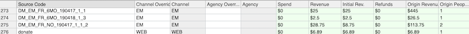
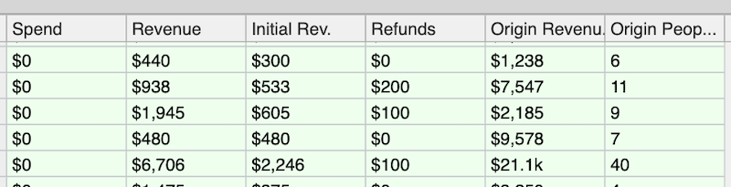
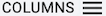

# The Source Code Dictionary

The Source Code Dictionary built as bots [analyze your message and transaction data](enrichment/pipeline) is the nerve center of your Frakture warehouse.

It's a complete index of every source code you've used, anywhere -- spanning across many years, many digital platforms, and (if you're like most) many different shapes and syntaxes for your source codes. No matter how unruly that data might seem, the Source Code Dictionary brings it all into view.

You can find the Source Code Dictionary in your Frakture Console, by clicking on Source Codes > Source Code Dictionary.

The Source Code Dictionary is arrayed as a spreadsheet, one row per source code with that source code in the leftmost column and other information defining the code in subsequent columns. The architecture ensuing heavily assumes that each source code is completely unique to a single message, and not re-used in message after message; as a result, you'll see "message" and "source code" used interchangeably in this document because the idea is that these are as matter and energy, the same stuff under different names.

There are several green-shaded fields flagging transaction data for any codes that have it. These fields are calculated by the bots based on source code-driven attribution of specific transactions to specific messages; as such, they might differ from message systems' natively-reported revenue figures. Frakture also differentiates a few related by distinct ways that you might think about messages' revenue performance.

### Spend

This is the cost associated with a source code; it's primarily used for the fees directly accrued by ads on platforms such as Facebook, Google and Bing.

### Initial Revenue

Initial Revenue comprises all the one-time transactions generated by a given message, plus only the _first installment_ of recurring gifts generated by the message. One loose way to think about it is as the money you pocketed on the day(s) the message went out, or directly after people clicked on the payment links.

If you use email and transaction pages from the same integrated CRM, Initial Revenue is likely to be the figure closest to that CRM's built-in performance report for a given email message.

### Revenue

Revenue is a (potentially) larger sum that expands the Initial Revenue concept to add all the _subsequent installments_ of recurring gifts that trace directly to a particular source code. For newly-deployed source codes, it's likely to be the same as Initial Revenue -- but over time, the Revenue figure can pile up as a code receives credit for long-running pledges.

Suppose as the result of an email appeal five donors each give a $10 gift, and a sixth kicks off a $6 monthly pledge. The Initial Revenue will be $56 (5 * $10, plus the $6 initial recurring installment). Revenue will also show $56 ... at first. A month later, when the recurring donor's second $6 installment tolls, the Revenue figure will climb to $62 ($56 + the new $6), while the Initial Revenue figure will remain at $56. Should this recurring gift remain active for years, the Revenue figure eventually could mount to several times the Initial Revenue total.

### Origin People and Origin Revenue

Transactions aren't the only thing that source codes can garner: they can also garner people, that is, new constituents, members, or supporters recruited by a particular message. Perhaps they joined your list with a transaction right off the bat, or perhaps it was "lighter" conversion via a signup or action form.

No matter what this new supporter did on the day they first joined entered your organization's list, every additional thing they do thereafter is in some measure a credit to the initial ask that earned the initial _"Yes"_.

That's what the two Origin fields are about. Origin People is a tally of person records whose earliest appearance can be traced to the source code in question. Origin Revenue is a total of all the revenue ever generated by such people, no matter whether that revenue occurred on the day they first joined or decades afterwards.

### Refunds

Self-explanatory, but [see here](enrichment/refunds) for more about how Frakture operationally utilizes refund amounts. The thing to be aware of is that Refunds are _not_ subtracted from the various raw revenue figures in this report (nor, in general, in any Frakture reports).

-----

Besides the revenue numbers, there are several additional columns noting information that the source in question encodes. You can customize these parameters by selecting among [over 15 available variables](enrichment/source_code_elements) using the  hamburger menu in the upper right, but the most commonly used are these:

### Channel (source_code_channel)

Channel for message delivery, such as SMS, Bing Ads, or Direct Mail.

### Source Code Date (source_code_date)

YYYYMMDD format of the source code date. Sometimes different from the core message's "publish date", and usually obtained by automatically parsing the source code.

### Goal (goal)

The descriptive (not numerical) goal of the message, e.g. Advocacy, Fundraising, Retention, Acquisition, or Ticket sales. Commonly used for differentiating conversion performance among different types of digital ads.

### Geography (geo)

For use if the message is targeted to a specific locale, a common parameter for digital ads -- e.g. Richmond, or VA, or East Coast.

-----

### Using Overrides

Frakture's bots will attempt to render elements such as the above by parsing source codes according to the syntax you supply us. However, each of the non-revenue elements above might be paired with an optional "Override" column, which is a human-editable column -- it's editable right there in the console Source Code Dictionary page -- where you can correct the automated reading or supply missing elements.

Just type the preferred value into the Override field, and the equivalent element field will update in real time. For example, if bots have misinterpreted your code's Goal as "Acquisition", you can type into the Goal Override field a corrected value such as "Fundraising" -- and you'll see the Goal change accordingly. (As will any downstream reports that make calculations with the Goal element.)

Because Override values are lodged separately in the database from automated defaults, deleting an override entry will snap the code back to its bot-assigned default.
