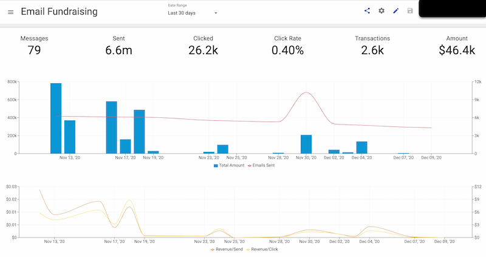
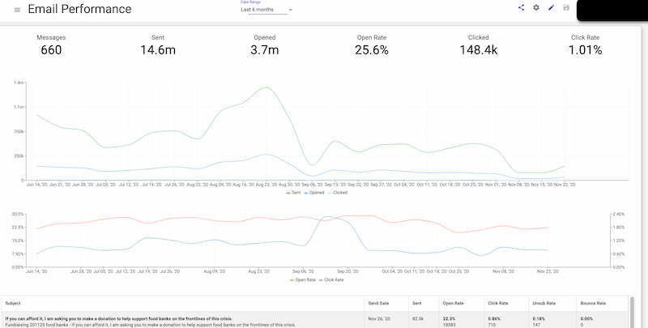
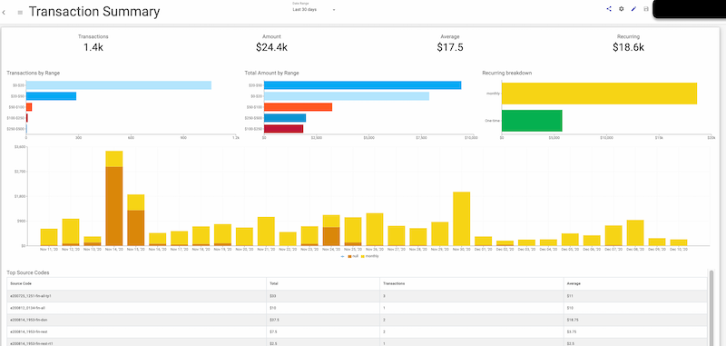
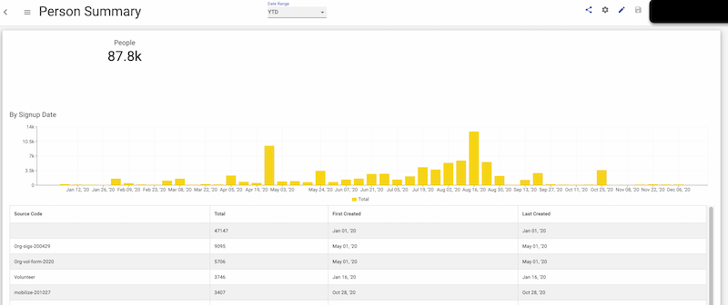

# Frakture Reports

The Frakture console provides a large and growing number of [reports](reports/reports_intro) that are ready to deploy with Frakture standard services. You'll be seeing cross-channel performance data in a whole new way right from the jump.

Access your Frakture reporting library through the "Reports" link atop your Frakture console.

## Level One Reports

Level 1 reports organize standard data about message performance, transactions, and supporters -- from all your channels, in a single convenient place, and readily filtered by date.

### Sample Report: Email Data

### Sample Report: Transactions

### Sample Report: People

## Level Two Reports

## Level Three Reports
