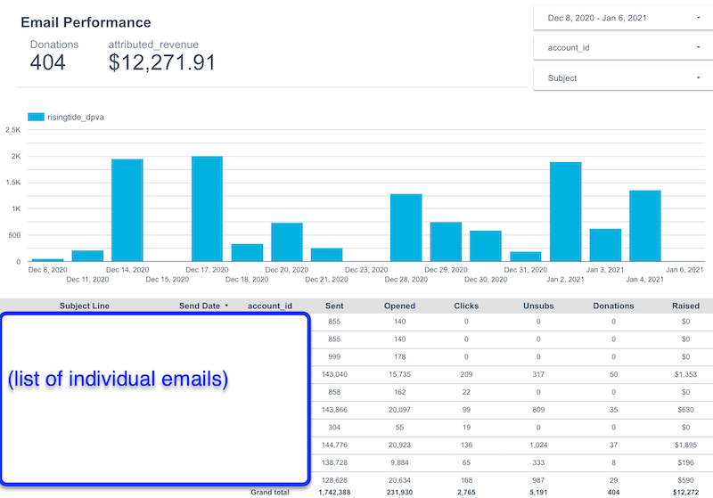
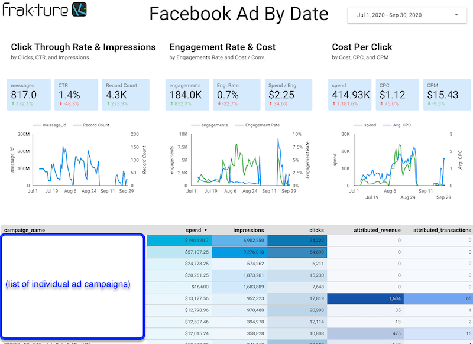
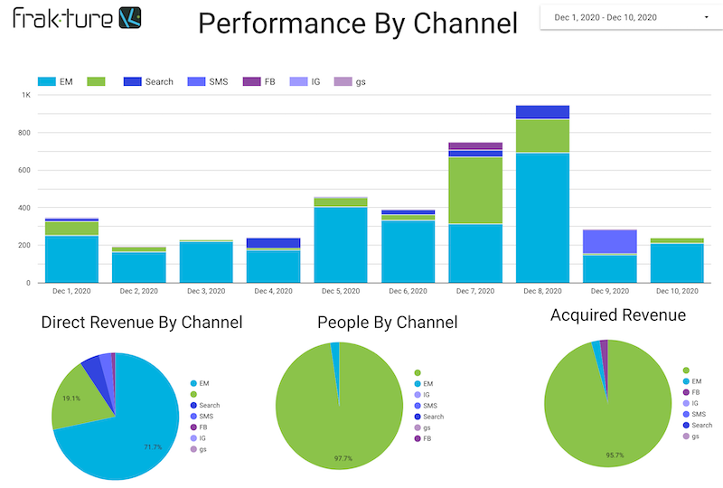

# Stock Google Data Studio Reports

Frakture offers a stock template for [Google Data Studio](https://datastudio.google.com). We'll be happy to deploy that for you on request.

Frakture's Data Studio template has pre-fab report pages ready-made to connect with the standard Level 1 and Level 2 data objects that our services construct. Below are some representative sample panels; your own reports might vary slightly.

### Disclaimers

While Google Data Studio is convenient and free, you should be aware that it has some limitations. Frakture can't provide comprehensive support on Data Studio, but these are some of the most common issues we've seen:

* To limit its bandwith footprint, Data Studio does not directly query live data tables, but rather caches that data. As a result, your data studio reports might lag behind updates to your warehouse data by several hours.

* Data Studio limits its cached data to 100,000 rows per object or table. When data sets exceed this figure, which can easily occur with the transaction history for medium to larger organizations, you'll experience unpredictable gaps in the reported data reflecting the fact that some rows have simply been excluded from Data Studio's cache. (Gaps in transaction history will also knock on to gaps in the sums attributed to messages.) Frakture itself _does_ have the complete data in the warehouse -- but Data Studio might not reflect it all.

* There are a few query idiosyncracies in Data Studio. We've done our best to steer around them in the stock templates but it's still possible you'll run into eyebrow-raising results, especially if you attempt to customize reports. One specific common bugbear is that Google has [a bug](https://support.google.com/datastudio/thread/13600719?hl=en) when combining aggregation functions (e.g. "Count Distinct", used for a tally of donor gifts) plus a date range filter (e.g. specifically the count of gifts last week, instead of all-time).
