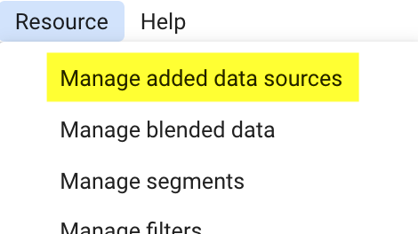

# Tips for Optimizing Google Data Studio with Frakture data

The free reporting package at Google Data Studio is one of the most commonly used tools for outputting warehouse data into reports. Frakture clients have access to our [stock Data Studio report templates](reports/reports_gds); whether customizing those templates to your needs or building afresh,

Note that detailed direct support of report customizations generally falls outside Frakture's standard service scope. Tips offered here are for guidance only.

## Adding Calculated Fields to Data Sources

Data Studio reports connect to data objects (tables or views) in the warehouse. Google calls these _Data Sources_.

Many of these same calculations can be defined within a single report chart, using similar syntax. When creating the metrics for a single chart or table, click "Create Field", and you can build your calculation on the fly!

The disadvantage to this approach is that the calculation will only be available to that single chart: if it's one that you might re-use in other charts or other reports, making the definition permanent on the Data Source will save you some legwork.

Data Sources can be enhanced in Google Data Studio past the fields they contain in the warehouse.

You might want to do this to capture percentages, ratios, or other figures expressing the relationship between two or more different fields: Frakture provides you the raw metric counts (such as the CRM's reported number of opens or clicks), but because different users have different data priorities and even different ways to define similar metrics, it's in your hands to create the second-order calculations that result (such as open rate or click rate).

To do this, navigate to your report's Data Source(s) by finding "Manage Added Data Sources" under your report's Resources menu. Then click "Edit" on the Data Source you intend to work with.

Now you're looking at the Data Source itself. Be aware that the Data Source is merely Google's cache of the underlying table of data in Frakture: you can't make any change in this environment that will corrupt the data as captured in your Frakture warehouse, so experiment with confidence!

To add a new calculated field, begin by clicking the "Add A Field" link in the upper right-hand corner.

After clicking the "Add A Field" link, you'll be looking at a blank box to define your field. Give the field a name, and then set up the field using Google's extensive menu of Excel-like [functions](https://support.google.com/datastudio/table/6379764?hl=en).

Here are a few common calculations you might want to consider.

### Timestamp fields ###

Frakture date fields (such as "ts" (timestamp) on transaction tables, or "publish_date" on message tables, or just "date" on various summary-by-date tabes) give a full _YYYY-MM-DD HH/:MM/:SS_ date (on a 24-hour clock).

* _WEEKDAY(ts)_, _WEEKDAY(publish_date)_ or _WEEKDAY(date)_ outputs the day of the week: useful if you're analyzing performance for Mondays as compared to Thursdays as compared to Saturdays. Zoom in even closer with _HOUR()_ to see if you should be sending that email first thing in the morning or wait to lunchtime.

* Conversely, zoom back out with functions like _MONTH()_, _QUARTER()_ or _YEAR()_ to capture big-picture aggregates. _WEEK()_ is an underrated star: it returns the number of the year's week that the date falls in, from 1 to 52, which is great for year-over-year performance comparison.

### Rate fields ###

Frakture data objects serve a large number of integer or decimal fields that can be combined and manipulated via Google's many [functions](https://support.google.com/datastudio/table/6379764?hl=en). Most of the core performance rates you're likely to need will look like simple Excel formulas involving two or three of Frakture's numerical fields.

* A very basic email open rate would simply be _email_opened/email_sent_. However ...

* Rate stats can get squirrelly when they're combined into larger aggregations, such as the stats for the entire month of June or the stats for an entire email campaign. You don't want the large-scale total to be "the average of the averages", weighing small-scale email sends the same as large ones. Because of that, we'd recommend preferring _SUM(email_opened)/SUM(email_sent)_ as your open rate definition. In the context of a single email, this is the exact same calculation ... but when the field is involved in a chart aggregation, it'll give you the correctly weighted rate based on all clicks and all opens in the sample.

* Similarly, consider _SUM(email_clicked)/SUM(email_sent)_ for the click rate, _SUM(email_clicked)/SUM(email_opened)_ for the click-open rate, _SUM(email_unsubscribes)/SUM(email_sent)_ for the unsubscribe rate, _SUM(email_hard_bounces)/SUM(email_sent)_ for the bounce rate.

* Some shops prefer to calculate rates relative only to emails that actually hit the inbox. To do that just make the denominator into opens minus bounces, like so: _SUM(email_clicked)/(SUM(email_opened)-SUM(email_hard_bounces))_
